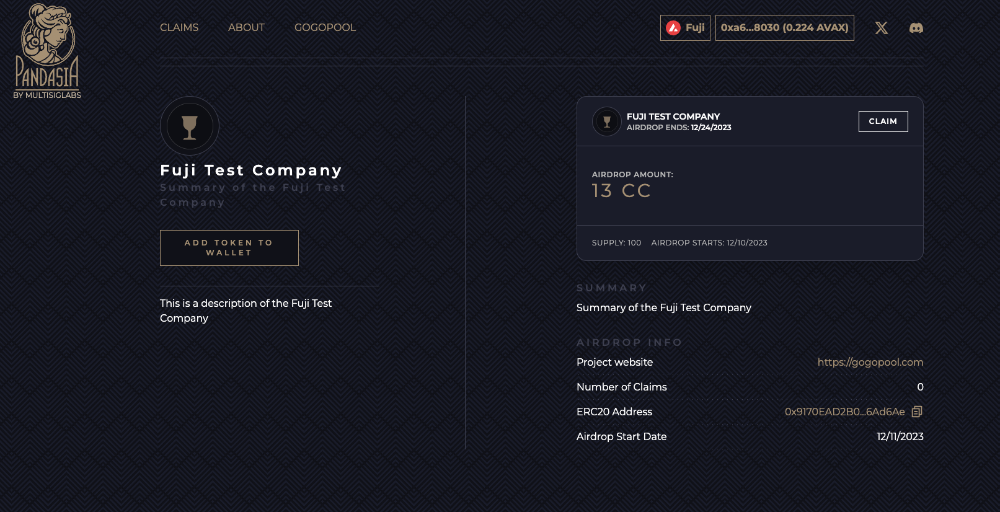

# Pandasia.io

One of the Charities, (Πανδαισία) "banquet for everyone"

# Commercial
https://youtu.be/bSNT-d-O0Sc

# Problem

The primary way to bootstrap a novel blockchain is through an airdrop to as wide and decentralized set of validators as possible. But because of the Avalanche Network design, this is very tricky to do. 

Validators exist on the P-chain, but airdrops, wallets, and smart contracts exist on the C-Chain. There is no easy way to link a validators profile on the P-chain to their C-Chain wallets. Because of that, there isn't an easy way for Subnets to airdrop tokens to validator nodes. 

This is a key blocker to helping Subnets grow through decentralization.

Introducing Pandasia.

# Idea

Pandasia is a smart contract protocol allowing Subnet teams to decentralize by airdropping tokens to registered Avalanche validators. 

# How to Use...

Here's a demo video of the registration flow. 

https://github.com/multisig-labs/pandasia/assets/13784188/f0236478-63a7-4f48-b1cf-a695ca2a09c0

### ...As a validator

If you're currently running your own validator node, head to [pandasia.io](https://pandasia.io)
and follow the steps to register. When signing the message, make sure the message contains the C-Chain address
you want to register with Pandasia, and sign it with your P-Chain rewards address.

If you have any issues reach out to us in [Discord](https://discord.gg/5bXrj6tc)!

### ...As a minipool operator

Are you a minipool operator with GoGoPool? You can access pandasia airdrops without having to register! Just log in with
your C-Chain address you use to run your minipool on [pandasia.io](https://pandasia.io).

### Looking to create your own airdrop?

Reach out to [@ggp_steven](https://t.me/ggp_steven) on Telegram and we'll get you started. 

## Technical Approach

### Registration

Users register with Pandasia by signing a message with their P-Chain rewards address. That message should be
the C-Chain address they want to use on Pandasia.

To verify a validator, we have them sign a message on wallet.avax.network with their P-Chain address, then construct
that same message in our smart contracts. If the signatures match they're allowed to register.

### User creates signed message

When you sign a message with [wallet.avax.network](https://wallet.avax.network), it prepends your message with additional information before hashing. For example we want the user to sign a message with their C-chain address, i.e. `0x0961Ca10D49B9B8e371aA0Bcf77fE5730b18f2E4`. So the actual message the wallet constructs for the user to sign is:

`\x1AAvalanche Signed Message:\n\x0000002A0x0961Ca10D49B9B8e371aA0Bcf77fE5730b18f2E4`

where `\x1A` is 26, the length of `Avalanche Signed Message:\n` and `\x0000002A` is 42, the length of the text string `0x0961Ca10D49B9B8e371aA0Bcf77fE5730b18f2E4`. The wallet then takes the `sha256` hash of those bytes, and that is the message that gets signed.

### Reconstructing the signed message

Using signature parts and msg.sender, we create the P-Chain address that will be registered. If the provided signature
and our created message don't mesh, we won't be able to construct a valid P-Chain address.

We do this in two parts:

1. We want to verify that the user signed their correct C-chain address, and not somebody elses. (After all its
   whatever they type in the message box so they can of course lie). We do this by constructing the message ourselves, in
   the Solidity contract, and using `msg.sender` as the C-chain address.

2. Then apply the user-provided signature against **our** message. Since the user cannot forge `msg.sender` we are sure that the P-chain key did in fact sign a message containing `msg.sender`.

Decomposing the signature is a little tricky, because the `ecrecover` precompile will take a signature, a message hash, and return an _ethereum_ address that signed it. But in our case a P-chain key signed the message, so `ecrecover` will give us the wrong address because the P-Chain address is derived differently than eth addresses.
We use a Solidity library `SECP256K1` to do this instead of the `ecrecover` precompile.

The C-chain address the user types in the message box MUST be of the mixed-case, checksummed variety. (Remember that an
Ethereum address has a clever built-in checksum that uses the case of the various letters as the checksum.) If they use
an all lowercase address (i.e. `0x0961ca10d49b9b8e371aa0bcf77fe5730b18f2e4`) then our system wont work, as we are
expecting mixed case.

### Tracking Validators

So now that we have a method for cryptographically linking a C-chain address to a P-chain address, the final piece to the
puzzle is determining if a specific P-Chain address was actually running a validator at one point. We cannot determine
this from Solidity, since the C-chain cannot query the P-chain for information.

The validator data must be collected off-chain, so we have built a Go program that slurps in the entire P-chain into a
SQLite DB, and tags addresses that have been used as a validator rewards address at any time in the past. The program
will also periodically create a giant Merkle Tree with all of these addresses, and post the merkle root to the Pandasia
contract. It will also provide an API so that a user can obtain the necessary merkle proof for their address, to submit
to the contract, which can verify their address and proof, against the merkle root.

With all those pieces in place, a user can now "register" with Pandasia and their C-chain address will be tagged as a verified validator. Projects can use Pandasia to distribute tokens to this group as airdrops to build community and reward those who are most heavily invested in the success of the Avalanche blockchain.

## Airdrops

Airdrops! Airdrops! Airdrops!

Projects create airdrops, depositing tokens to be distributed to registered validators!
The start and end time can be configured, as well as the distribution amount.

# What's coming

- [ ] Currently you need to contact MultisigLabs to create an airdrop, but we plan to open it up to the public soon.
- [ ] Delegators will be able to register and receive airdrops
- [ ] Subnet teams will be able to airdrop locked escrow tokens that vest over a period of time
- [ ] If you have any ideas on how to make Pandasia more useful to Subnets, send a message on Discord! 
