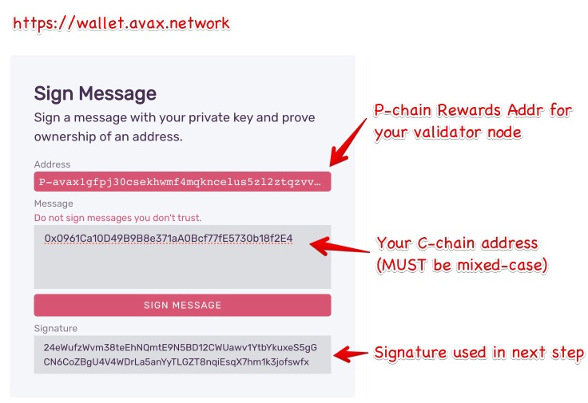
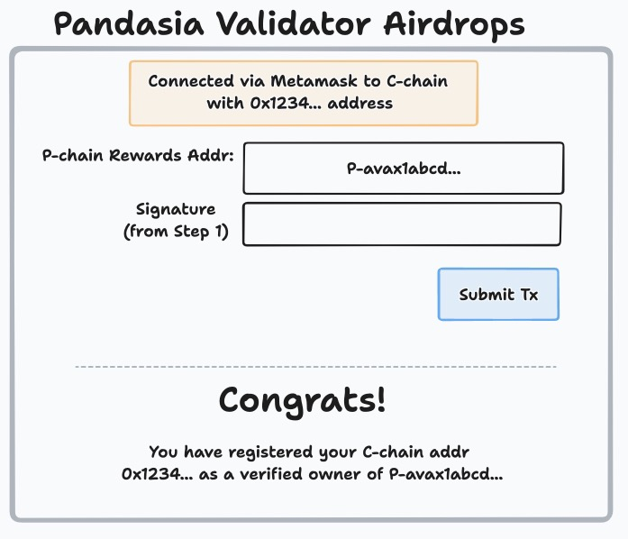

# Pandasia

One of the Charities, (Πανδαισία) "banquet for everyone"

# 💡Idea

Be “the place” where user’s can come to “claim” their validator node, tying their C-chain addr to a P-chain addr. Then build web UI for projects to come and airdrop tokens / NFTs to the “verified” validator community. Of course any Minipool operator will automatically get boosted rewards 😈

# UX

1. User must go to old avax wallet and go to Advanced tab, and sign a message containing their C-chain addr, signing with a P-chain addr that was a rewards addr for a validator at anytime in the past.

2. Now user comes to our new site, and pastes in the signature from step 1, then submits the tx and signs with Metamask

   🥵 This is a confusing ask maybe for users, but not sure how else to do it

## Technical Approach

When you sign a "message" in the wallet, you do not sign a hash of the message you typed in, instead the wallet formats what you type as part of a larger message, behind the scenes. In our case, we want the user to sign a message with their C-chain address, i.e. `0x0961Ca10D49B9B8e371aA0Bcf77fE5730b18f2E4`. So the actual messgage the wallet constructs for the user to sign is:

`\x1AAvalanche Signed Message:\n\x0000002A0x0961Ca10D49B9B8e371aA0Bcf77fE5730b18f2E4`

where `\x1A` is 26, the length of `AAvalanche Signed Message:\n` and `\x0000002A` is 42, the length of the text string `0x0961Ca10D49B9B8e371aA0Bcf77fE5730b18f2E4`

The wallet then takes the `sha256` hash of those bytes, and that is the message that gets signed.

The reason we need to know all of this, is that we want to be able to, in Solidity, recover the P-Chain addr that signed the message, and also verify that the message that was signed was correct and unforgeable.

Our first obstacle is that the `ecrecover` precompile will take a signature, a message hash, and return an ethereum **address** that signed it. But in our case a P-chain key signed the message, so `ecrecover` will give us the wrong address. This is because given the same Public Key, the address for that key is derived differently on eth/c-chain and p/x-chain. So we need the raw Public Key not the ethereum address for that key. So we use a Solidity library to do this instead of the `ecrecover` precompile.

Next, we want to also verify that the user signed their correct C-chain address, and not somebody elses. (After all its whatever they type in the message box so they can of course lie). We do this by constructing the message ourselves, in the Solidity contract, and using `msg.sender` as the C-chain address, and apply the user-provided signature against **our** message. Since the user cannot forge `msg.sender` we are sure that the P-chain key did in fact sign a message containing `msg.sender`.

One quirk is that the C-chain address the user types in the message box MUST be of the mixed-case, checksummed variety. (Remember that an Ethereum address has a clever built-in checksum that uses the case of the various letters as the checksum.) If they use an all lowercase address (i.e. `0x0961ca10d49b9b8e371aa0bcf77fe5730b18f2e4`) then our system wont work, as we are expecting mixed case.

So now we have a method for linking, cryptographically, a C-chain address to a P-chain address. The final piece to the puzzle is we need a way to determine if a specific P-chain addr was actually running a validator on one point. We cannot determine this from Solidity, since the C-chain cannot query the P-chain for information.

The validator data must be collected off-chain, so we have built a Go program that slurps in the entire P-chain into a SQLite DB, and tags addresses that have been used as a validator rewards address at any time in the past. The program will also periodically create a giant Merkle Tree with all of these addresses, and post the merkle root to the pandasia contract. It will also provide an API so that a user can obtain the necessary merkle proof for their address, to submit to the contract, which can verify their address and proof, against the merkle root.

With all those pieces in place, a user can now "register" with Pandasia and their C-chain address will be tagged as a verified validator. Projects can use Pandasia to distribute tokens to this group as airdrops to build community and reward those who are most heavily invested in the success of the Avalanche blockchain.
